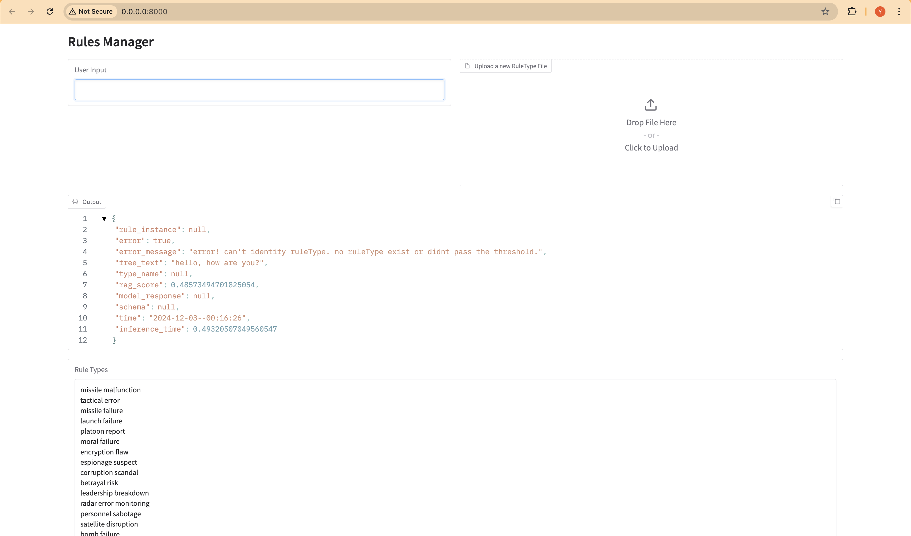
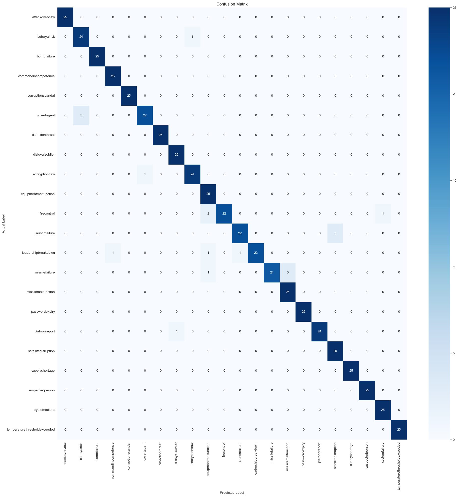

# getting started

# Installation

```angular2html
git lfs install
```
or:
```angular2html
curl -s https://packagecloud.io/install/repositories/github/git-lfs/script.deb.sh | sudo bash
sudo apt install git-lfs
```

if using the package and not the docker:
## - downlads (if using internet):
gemma:
```
curl -L -O https://huggingface.co/lmstudio-community/gemma-2-2b-it-GGUF/resolve/main/gemma-2-2b-it-Q8_0.gguf
```
rag:
```
git clone https://huggingface.co/BAAI/bge-m3
```
## - steps:
1. place the data_directory in your desire place.
2. with your terminal, go to the project folder and run:
    ```
   pip install -e .
   ```

### - notes:
* to uninstall run: `pip uninstall RIG`

## how to use:


```python
from RIG import RuleInstanceGenerator
```


```python
# (required means that you can chnge it in globlas.py and it will not be required.)

rig = RuleInstanceGenerator(
    project_directory="",  # required
    gpt_model_path="", # required
    rag_model_path="", # required
    rule_types_directory="", # optional. if you want to load rule-types from directory.
    rag_threshold=0.5, # oprional
    max_context_length=1024, # optional
    max_new_tokens=512, # optional
    n_threads=5 # optional
)
```


```python
# get list of existing rule types:
rig.get_rule_types()
```
 ['missile malfunction',
  'tactical error',
  'missile failure',
  'launch failure',
  'platoon report',
  'moral failure',
  'encryption flaw',
  'espionage suspect',
  'corruption scandal',
  'betrayal risk',
  'leadership breakdown',
  'radar error monitoring',
  'personnel sabotage',
  'satellite disruption',
  'bomb failure',
  'defection threat',
  'attack overview',
  'fire control',
  'disloyal soldier',
  'equipment malfunction',
  'command incompetence',
  'supply shortage',
  'system failure',
  'covert agent',
  'suspected person']


## get rule instance from free text

```angular2html
rig.init_gemma_model()
```


```python
free_text = "Alright, let's dive in. We're looking at 'Exploitation Scenario 789'. The crux of the matter is, there's this individual, going by the ID 'XYZ789', who's been involved in an exploitation failure. The level of seriousness? I'd estimate about three. The breach? Fairness. Not good, not good at all. When did we spot this? Well, the detection time isn't clear. And the context? Personal. Yes, it's a pretty serious situation"

response = rig.get_rule_instance(free_text) # return dictionary
```


```python
response.keys()
```

dict_keys(['rule_instance', 'error', 'error_message', 'free_text', 'type_name', 'rag_score', 'model_response', 'schema', 'time', 'inference_time'])


```python
response["rule_instance"] # the package response
```


output:

    {'_id': '00000000-0000-0000-0000-000000000000',
     'description': 'string',
     'isActive': True,
     'lastUpdateTime': '00/00/0000 00:00:00',
     'params': {'individualID': 'XYZ789',
      'failureType': 'Fairness',
      'detectionTime': 'null',
      'ethicalViolation': 'null',
      'context': 'Personal'},
     'ruleInstanceName': 'Exploitation Scenario 789',
     'severity': 3,
     'ruleType': 'structured',
     'ruleOwner': '',
     'ruleTypeId': '7a2f6c94-2b4f-4d9d-8a77-d11f7c7cc8fc',
     'eventDetails': [{'objectName': 'Moral',
       'objectDescription': None,
       'timeWindowInMilliseconds': 0,
       'useLatest': False}],
     'additionalInformation': {},
     'presetId': '00000000-0000-0000-0000-000000000000'}


```python
# giving us feedback on the response. it will help us to improve the project. it stores in .logs file, without internet connection.
rig.feedback(True)  # or 0.8, or what ever you can  
```
thank you :)


## run evaluation:
```
rig.evaluate(
    data_dile_path="/Users/yuda/Desktop/RIG_v1/evaluation/data/data_yuda.csv",
    output_directory="/Users/yuda/Desktop/RIG_v1/evaluation/output",
    start_point = 0,
    end_point = 1, # None = all the data
    sleep_time_each_10_iter = 30
)
```


## using the GUI
very basic, work only with the globals file constant


```python
from RIG.src.Utils.GUI import run_gui
run_gui()
```

llama_new_context_with_model: n_ctx_per_seq (1024) < n_ctx_train (8192) -- the full capacity of the model will not be utilized
ggml_metal_init: skipping kernel_get_rows_bf16                     (not supported)
ggml_metal_init: skipping kernel_mul_mv_bf16_f32                   (not supported)
{...}

* Running on local URL:  http://0.0.0.0:8000

To create a public link, set `share=True` in `launch()`.



### eval of classification

